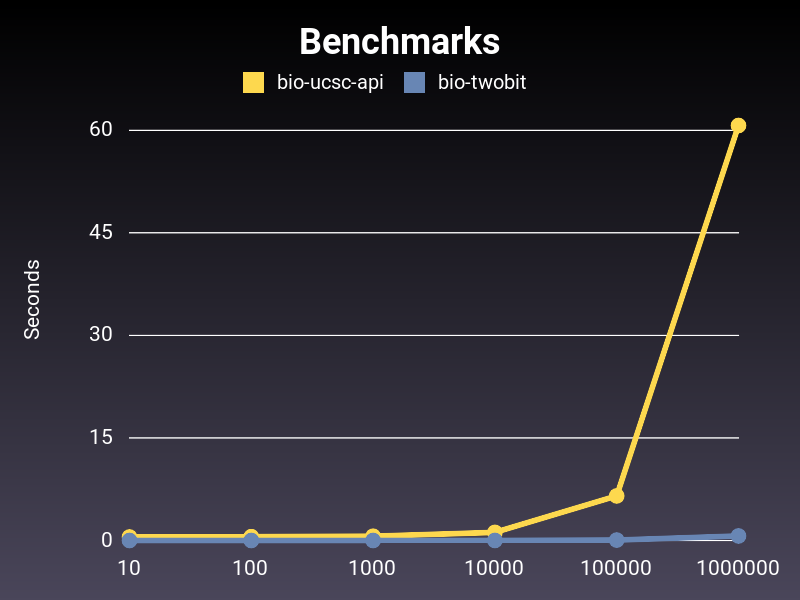

# Summary

bio-twobit is a fast 2bit file reader for ruby.

Code : [https://github.com/ruby-on-bioc/bio-twobit](https://github.com/ruby-on-bioc/bio-twobit)

# Statement of need

It is common to want to know the sequence of a specific position in the genome. 2bit file format is an efficient genome file format provided by the UCSC Genome Browser [@navarrogonzalez2021]. By using this file format, you can quickly access specific regions of the reference genome.

2-bit files can be read and written in R and Python. However, there are limited ways to access 2bit files from the Ruby language.

bio-ucsc-api [@mishima2012], one of the gems of BioRuby [@goto2010], has methods to read 2-bit files. But they are implemented in Ruby, so they are not fast enough.

Here we present bio-twobit. This is a binding to lib2bit [@ryan2017], a library implemented in the C, and has a Python interface API called py2bit [@ryan2018]. bio-twobit speeds up access to the reference genome using the Ruby language, making it easier to use in web applications.

# Benchmark

{ width=50% }

The x-axis is the number of times "chr17:7579614-7579700" is called.
[Code used for benchmarking](https://github.com/ruby-on-bioc/bio-twobit/blob/paper/paper/benchmark/twobit.rb)

# Examples

Setup:

```ruby
require 'bio/twobit'
```

Load a 2bit file:

```ruby
hg38 = Bio::TwoBit.open("BSgenome.Hsapiens.UCSC.hg38/inst/extdata/single_sequences.2bit")
```

Print file information:

```ruby
hg38.info
# {"file_size"=>818064875,
# "nChroms"=>640,
# "sequence_length"=>3272116950,
# "hard_masked_length"=>161368694,
# "soft_masked_length"=>0}
```

Fetch a sequence:

```ruby
hg38.sequence("chr1", 50000, 50050)
# "AAACAGGTTAATCGCCACGACATAGTAGTATTTAGAGTTACTAGTAAGCC"
```

Fetch per-base statistics:

```ruby
hg38.bases("chr1", 10000, 10100)
# {"A"=>0.34, "C"=>0.49, "T"=>0.17, "G"=>0.0}

hg38.bases("chr1", 10000, 10100, fraction: false)
# {"A"=>34, "C"=>49, "T"=>17, "G"=>0}

hg38.bases("chr1") 
# {"A"=>0.26940569141052323,
# "C"=>0.19302592242428676,
# "T"=>0.2701041550155312,
# "G"=>0.19325280952182064}
```

Fetch masked blocks

```ruby
hg38.hard_masked_blocks("chr1", 0, 1000000)
# [[0, 10000], [207666, 257666], [297968, 347968], [535988, 585988]]
```

# Reference
